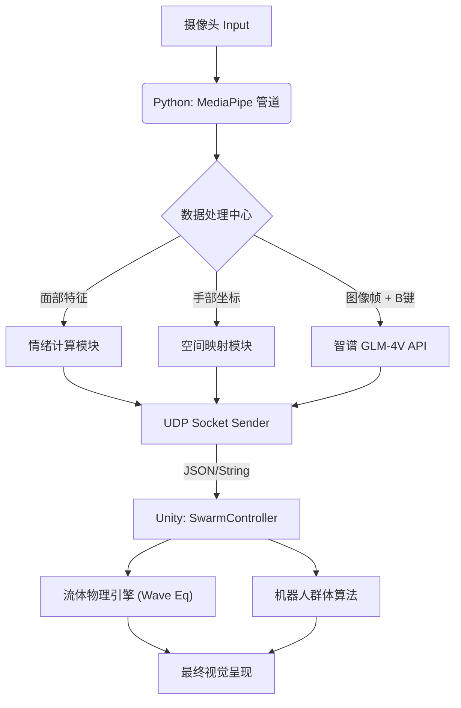

# Mind-Matter: Embodied Swarm Intelligence for Future Classroom
# 心物耦合：面向未来教室的具身智能群体机器人空间

> 同济大学“未来技术导论”课程大作业 | Tongji University Future Technology Coursework

<div align="center">


[演示视频] | [项目文档] | [English Version]

**"Knowledge should be tangible." (知识应当是可触摸的)**

</div>

---

## 📖 项目介绍 (Introduction)

**Mind-Matter** 是一个探索 2035 年智慧教育场景的原型系统。它突破了传统的图形用户界面 (GUI)，提出了 **具身认知 (Embodied Cognition)** 的全新交互范式。

系统利用计算机视觉捕捉学生的情绪、视线与手势，通过 **UDP 协议** 实时驱动桌面上的纳米群体机器人（Swarm Robotics）进行物理重构。无论是地理课的山川隆起，还是物理课的引力塌陷，桌面都能通过 **流体动力学仿真** 与 **多模态 AI**，让抽象知识在指尖“实体化”。

## ✨ 核心特性 (Key Features)

### 🧠 感知层 (The Brain - Python)
* **多模态情感计算**: 实时分析面部微表情（困惑皱眉、兴奋微笑、疲劳眨眼），量化学生的学习状态。
* **具身手势交互 (God's Hand)**:
    * **双极力场**: 左手造山（隆起），右手造海（塌陷）。
    * **上帝视角**: 支持双指尖实时 3D 坐标映射。
* **AI 视觉语义识别**: 集成 **智谱 GLM-4V** 大模型，识别摄像头前的书籍/物体，自动切换学科场景（如识别《时间简史》自动切换至物理黑洞模式）。

### 🌊 表现层 (The Body - Unity)
* **实时流体仿真 (Shallow Water Simulation)**: 基于波动方程的物理级液态表面，支持波纹干涉、阻尼衰减与障碍物反弹。
* **自适应群体算法**: 机器人自动避障（书本）、智能聚合与离散。
* **分层设色渲染**: 地理模式下根据高度自动渲染植被、岩石与积雪效果。
* **混合控制架构**: 支持 "AI 自动接管" 与 "手动控制" 的无缝热切换。

---

## 🛠️ 安装指南 (Installation)

### 前置要求
* **摄像头**: 能够捕捉面部与手部（建议 720p 以上）。
* **API Key**: 获取智谱 AI (BigModel) 的 API Key。

### 1. Python 端环境配置

推荐使用 conda 创建独立环境：

```bash
# 1. 创建并激活环境
conda create -n future_class python=3.10
conda activate future_class

# 2. 安装依赖 (使用 requirements.txt)
pip install -r requirements.txt
```

**配置 API Key:**

打开 `mind_reader.py`，找到以下代码行并填入你的 Key：

```python
ZHIPU_API_KEY = "your_api_key_here" 
```

### 2. Unity 端环境配置

* **Unity 版本**: 6000.3.1f1 (Unity 6)
* **导入方式**:
    1. 使用 Unity Hub 点击 **Add**，选择仓库中的 `FutureClassroom` 文件夹。
    2. 等待 Unity 自动导入包与构建 Library 缓存（首次需 3-5 分钟）。
    3. 打开 `Assets/Scenes/SampleScene`。

---

## 🎮 使用手册 (User Manual)

### 🚀 快速启动
1. 点击 Unity 编辑器的 **Play** 按钮。
2. 运行 Python 脚本：`python mind_reader.py`。
3. 对着摄像头保持面部放松，按 **C** 键进行面部基准校准。

### 🎹 快捷键与交互 (Controls)

| 按键/操作 | 功能描述 | 备注 |
| :--- | :--- | :--- |
| **C** | Calibrate (校准) | 重置面部表情基准值，建议每次启动后先做一次。 |
| **B** | Book Scan (识书) | 举起书本按 B，调用 AI 识别学科并重构桌面。 |
| **H** | Hand Toggle (手势) | 开启/关闭手势追踪功能。 |
| **左手移动** | 造山 (Mountain) | 桌面对应位置隆起，生成正向波源。 |
| **右手移动** | 造海 (Void) | 桌面对应位置塌陷，生成引力漏斗。 |
| **UI 面板** | 手动控制 | 在 Unity 左上角可手动强制切换学科或情绪。 |

### 🌍 学科模式说明 (Subject Modes)
* **⚛️ Physics (物理)**: 模拟引力场 (Gravity Wells)，物体产生时空弯曲，引力大小随距离衰减。
* **🌍 Geography (地理)**: 启用分层设色 (Hypsometric Tinting)，随高度变化自动渲染绿地、黄土、高山与雪顶。
* **📐 Math (数学)**: 生成马鞍面 (Saddle Surface) 或双曲抛物面，展示复杂的几何曲率。
* **🏛️ History (历史)**: 结构化数据展示模式（当前版本为基础矩阵排列）。

### 🎭 情感状态说明 (Emotional States)
* **😐 Normal (待机)**: 镜面水波，完全物理静止，等待手势搅动。颜色：**科技蓝**。
* **😁 Happy (快乐)**: 雨滴模式，随机落下轻快的波纹。颜色：**生机绿**。
* **🤔 Confused (困惑)**: 触发学科专属的复杂几何变换（如物理引力坑、数学马鞍面），帮助学生理解难点。颜色：**深邃黑**。
* **😴 Sleepy (疲劳)**: 呼吸模式，桌面进行缓慢的整体正弦起伏，提示需要休息。颜色：**警示橙**。

---

## 🤝 贡献与架构 (Architecture)



## 📄 版权说明 (License)

本项目采用 Apache 2.0 许可证。
This project is licensed under the Apache License 2.0.

Author: Zhuang Chengbo (Mike) @ Tongji University
